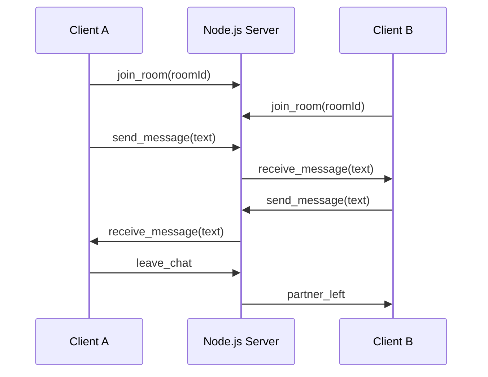

# AnonChat - Hackathon Submission (Klymo Ascent 1.0)

AnonChat is a privacy-first, real-time, 1-to-1 anonymous chat platform with AI-backed human verification, safety controls, and a Redis-powered matchmaking queue. The system is built to be stateless for chat content and scalable across multiple server instances.

**Team Name:** Team Knapsack  
**Team Members:** Sanchit garg, Chinmay soni, Tanish Garg  
**Hackathon:** Klymo Ascent 1.0

## What This Project Delivers

AnonChat focuses on "controlled anonymity": users remain anonymous, but the platform enforces safety and fairness via verification, rate limits, and abuse prevention.

Key goals achieved:
1. Anonymous onboarding with no accounts.
2. Verified human-to-human matching.
3. Ephemeral chats with zero server-side chat history.
4. Redis-backed queue and socket scaling.
5. Strong privacy guarantees with explicit data deletion.

## Core Features

1. **Anonymous onboarding**
2. **Device identity without PII**
3. **AI gender verification with liveness**
4. **Random 1-to-1 matchmaking**
5. **Realtime WebSocket chat**
6. **PII protection in chat**
7. **Abuse prevention and reporting**
8. **Daily match limits**
9. **Redis-backed horizontal scaling**
10. **Admin metrics + system status endpoints**

## Privacy-First Design (Deep Dive)

AnonChat is designed to minimize data retention while still keeping the system safe.

### 1. No server-side chat history
Chat messages are never written to disk or stored in any database. Messages are transmitted via Socket.IO and exist only:
1. In the sender's browser memory.
2. In the receiver's browser memory.
3. In transit over WebSocket.

When a session ends:
1. The client clears `sessionStorage` for the room and partner metadata.
2. The socket leaves the room.
3. The server does not retain any chat logs because none are stored.

### 2. Immediate deletion of verification images
The gender verification flow is explicitly designed to delete image data immediately.

On the Node.js server:
1. The client sends a base64 image.
2. The server converts it to a Buffer in memory.
3. The buffer is forwarded to the Python verification service.
4. Nothing is written to disk.

On the Python verification service (`server/gender-service/main.py`):
1. Image bytes are loaded into memory.
2. Gender + liveness inference runs.
3. `image_bytes` and `image_array` are deleted in `finally` block.
4. The `UploadFile` is closed immediately.

Result: **no verification images are persisted**.

### 3. Tokenized verification instead of identity
After verification:
1. A short-lived verification token is signed with HMAC (`VERIFICATION_TOKEN_SECRET`).
2. The token includes deviceId, gender, and expiry.
3. Tokens expire by TTL and are validated server-side.

### 4. Device identity without collecting personal data
Device identity is derived from a FingerprintJS hash:
1. Browser fingerprint → SHA-256 hash + salt.
2. Stored locally as `anon_chat_device_id` in localStorage.
3. Used only for daily limits and safety controls.

No emails, phone numbers, or personal identifiers are required.

### 5. Minimal Redis persistence (metadata only)
Redis is used to store **only metadata**, never chat content.

Stored in Redis:
1. Match queue (temporary).
2. Daily match counts (TTL).
3. Reports (TTL).
4. Bans (TTL or manual reset).
5. Blocks list.

Chat content is never stored.

## What Data Is Stored and Where

| Data Type | Location | Retention | Purpose |
| --- | --- | --- | --- |
| Chat messages | Browser memory only | Until tab closes or session ends | Realtime chat UI |
| Room + partner info | `sessionStorage` | Until leave/refresh | Routing to chat room |
| Device fingerprint hash | `localStorage` | Persistent (client only) | Abuse prevention and limits |
| Verification token | `localStorage` | Until token expires | Proof of verification |
| Match queue entries | Redis list | Until matched/disconnected | Matchmaking |
| Match counts | Redis hash | 48 hours TTL | Daily limit enforcement |
| Reports | Redis set | 7 days TTL | Auto-ban logic |
| Bans | Redis hash | 24 hours per ban | Safety enforcement |
| Blocks | Redis set | Until reset | Prevent rematching |

## Detailed Architecture

### System Components

1. **Next.js Client (`klymo_client`)**
2. **Node.js + Socket.IO Server (`server/index.js`)**
3. **Redis (Queue + Adapter + Safety State)**
4. **Python Gender Verification Service (`server/gender-service`)**

### Queue + Socket Flow (Mermaid)

```mermaid
flowchart LR
  A["Client (Next.js)"] -->|Socket.IO join_queue| B["Node.js Server"]
  B -->|LPUSH (user payload)| C["Redis Queue (anonchat:queue)"]
  B -->|LRANGE (top 50)| C
  B -->|Compatibility + block checks| B
  B -->|LREM matched partner| C
  B -->|Socket.IO match_found| A
```

### Realtime Chat Flow (Mermaid)



## How the Redis Queue Works (Step-by-Step)

1. **User joins queue**
   `LPUSH anonchat:queue <userPayload>`
2. **Server scans top candidates**
   `LRANGE anonchat:queue 0 49`
3. **Compatibility checks**
   Self-match prevention, gender preference match, blocks, and repeat prevention.
4. **Socket validation**
   The server checks if the socket is still active.
5. **Atomic removal**
   `LREM anonchat:queue 1 <matchedPayload>`
6. **Room created**
   Both clients receive `match_found` with the same room ID.
7. **Queue cleanup on disconnect**
   `removeBySocketId` scans and removes stale queue entries.

This design allows horizontal scaling because:
1. Queue state lives in Redis.
2. Socket.IO Redis adapter broadcasts match events across servers.

## Matching Rules (Server Enforced)

1. Must be verified by AI (token validated).
2. Daily match limit enforced.
3. No rematching with last partner.
4. Blocked users are excluded.
5. Gender preferences must match.

## Safety and Abuse Prevention

1. **Rate limiting**: 30 requests per minute per IP.
2. **PII detection**: Blocks sharing emails or phone numbers in chat.
3. **Profanity filter**: Applied to nickname and bio.
4. **Report system**: Unique reporters are counted in Redis.
5. **Auto-bans**: Triggered once report threshold is reached.
6. **Blocks**: Users can block others permanently.

## AI Verification Pipeline

1. User captures live selfie.
2. Client sends base64 image to `/api/verify`.
3. Node.js server forwards image to FastAPI service.
4. FastAPI service detects a face, runs liveness (MiniFASNetV2), and classifies gender (OpenCV DNN).
5. Result is returned with a signed verification token.
6. Image bytes are deleted immediately.

## API Endpoints

1. `POST /api/verify`
2. `GET /api/stats`
3. `GET /api/admin/metrics`
4. `GET /api/nuclear-reset`
5. `GET /healthz`

## Socket.IO Events

1. `join_queue`
2. `match_found`
3. `join_room`
4. `send_message`
5. `receive_message`
6. `send_image`
7. `typing`
8. `partner_typing`
9. `leave_chat`
10. `partner_left`
11. `report_user`
12. `block_user`

## Project Structure

```
/server
  index.js
  /gender-service
/klymo_client
  /src
```

## Local Development

### 1. Start Redis
Make sure Redis is running locally.

### 2. Start the Node.js server
```bash
cd server
npm install
npm run dev
```

### 3. Start the Python gender service
```bash
cd server/gender-service
pip install -r requirements.txt
python main.py
```

### 4. Start the Next.js client
```bash
cd klymo_client
npm install
npm run dev
```

### 5. Configure environment variables

`server/.env`
```
PORT=3002
REDIS_URL=redis://localhost:6379
CLIENT_ORIGINS=http://localhost:3000
GENDER_SERVICE_URL=http://localhost:8000
DAILY_MATCH_LIMIT=100
REPORT_THRESHOLD=5
REPORT_TTL_SECONDS=604800
MATCH_COUNT_TTL_SECONDS=172800
VERIFICATION_TOKEN_SECRET=change_me_in_production
VERIFICATION_TOKEN_TTL_SECONDS=86400
```

`klymo_client/.env`
```
NEXT_PUBLIC_SOCKET_URL=http://127.0.0.1:3002
NEXT_PUBLIC_API_URL=http://127.0.0.1:3002
```

## Notes on Deletion and Ephemerality

AnonChat does not store chat messages or images at rest. Deletion is achieved through:
1. In-memory processing for all verification images.
2. Browser-only message state for chat.
3. Explicit cleanup on chat exit.
4. Redis TTLs on match counts and reports.

Session teardown details:
1. `sessionStorage` keys `current_room`, `partner_info`, and `report_target` are removed when the user leaves.
2. Socket.IO leaves the room and notifies the partner (`partner_left`).
3. The server does not persist chat content at any time.
4. Any stale queue entries are removed on disconnect via `removeBySocketId`.

## Hackathon Pitch Summary

AnonChat proves that anonymous platforms can be safe by combining:
1. Privacy-preserving AI verification.
2. Stateless chat sessions.
3. Redis-backed scalable matchmaking.
4. Strong safety tools (report, block, rate limits).

This is a privacy-first alternative to anonymous chat apps that usually trade safety for anonymity.
